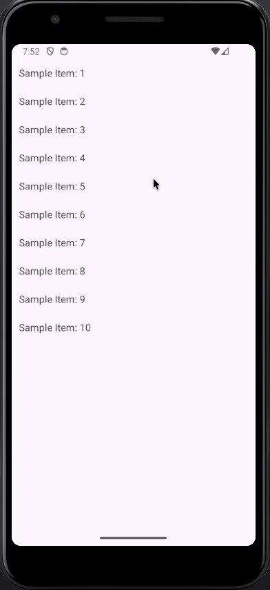
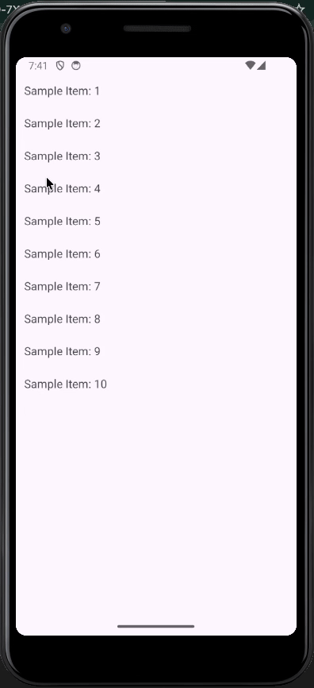
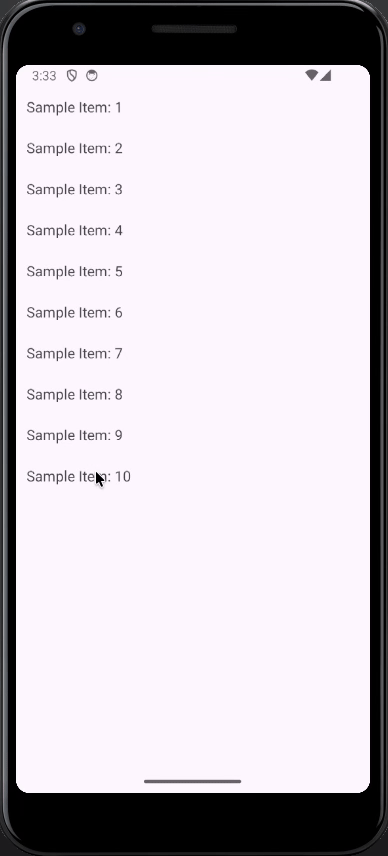

# RecyclerPlus

---
**RecyclerPlus** is a lightweight Android library that makes it easy to add modern swipe and drag gestures, icons, and background actions to your RecyclerView items, without all the boilerplate.

## Features

---
### Left & Right Swipe Actions
Add smooth swipe gestures on both sides of a RecyclerView item with customizable text, icons, and background colors.

### Customizable Swipe UI
Control the icon, text, size, positioning, and background color for each swipe direction - designed to always stay behind the item as it moves.

### ↔Intelligent Swipe Layout Handling
Text and icons automatically adjust based on swipe distance to avoid overlap, snap, or clipping.

### Drag-to-Reorder (Full-Row Drag)
Enable item reordering by dragging anywhere on the item — no extra handles needed.

### Drag Handle Support
Prefer a drag handle? Let users reorder only when they hold a specific view (e.g., a “grip” icon) inside the item.

### Plug-and-Play Integration
Works with any RecyclerView + adapter setup with minimal boilerplate. No need to override multiple callbacks or write custom ItemTouchHelpers.

### Smart Coordinate & Position Management
Automatically calculates item movement, displacement (dX), icon/text placement, and swipe background area — so everything aligns perfectly.

### Lightweight & Dependency-Free
No unnecessary dependencies — the library is small, efficient, and built completely on Android's ItemTouchHelper.

## Installation & Usage

---
#### Add the dependency in app's `build.gradle` file:

```gradle
dependencies {
    implementation("io.github.pparekh2009:recyclerplus:1.0.0")
}
```

#### Configure Swipe & Drag Behavior

```kotlin
val recyclerView = findViewById(R.id.recyclerview)

val leftSwipeConfig = SwipeConfig.Builder()
    .setText("Delete") 
    .setBackgroundColor("#ba280b".toColorInt())
    .setTextSize(50f)
    .setTextColor(Color.WHITE)
    .setIcon(this, R.drawable.rounded_delete_24)
    .setIconTint(Color.WHITE)
    .setIconSize(80)
    .setOnSwipeListener { position ->
        itemList.removeAt(position)
        itemViewAdapter?.notifyItemRemoved(position)
        Toast.makeText(this, "Swiped Left: $position", Toast.LENGTH_SHORT).show()
    }
    .build()

val rightSwipeConfig = SwipeConfig.Builder()
    .setText("Edit")
    .setBackgroundColor("#1d3ee0".toColorInt())
    .setTextSize(50f)
    .setTextColor(Color.WHITE)
    .setIcon(this, R.drawable.rounded_delete_24)
    .setIconTint(Color.WHITE)
    .setIconSize(80)
    .setOnSwipeListener { position ->
        Toast.makeText(this, "Swiped Right: $position", Toast.LENGTH_SHORT).show()
    }
    .build()

// Configure RecyclerPlus
val recyclerPlusTouchHelper = RecyclerPlusTouchHelper.Builder()
    .enableDrag()         // Drag whole row
    .enableDragOnView()   // Drag using a specific view (optional)
    .setLeftSwipeConfig(leftSwipeConfig)
    .setRightSwipeConfig(rightSwipeConfig)
    .create()

// Attach helper to RecyclerView
binding.itemList.setTouchHelper(recyclerPlusTouchHelper)
``` 

#### Optional: Drag using specific view

If you use `.enableDragOnView()`, pass recyclerPlusTouchHelper to recyclerView adapter
```kotlin
itemViewAdapter = ItemListAdapter(itemList, recyclerPlusTouchHelper)
```
And add this in the adapter's `onBindViewHolder()` function

```kotlin
dragView.setOnLongClickListener {
    recyclerPlusTouchHelper.startDrag(holder)
    true
}
```
This allows dragging only when the user holds the specific “drag handle” view.

## Screenshots

---

| Left Swipe                               | Right Swipe                                | Drag to Reorder                         |
|------------------------------------------|--------------------------------------------|-----------------------------------------|
|  |  |  |


## License

---
This project is licensed under the MIT License – see the [LICENSE](LICENSE) file for details.